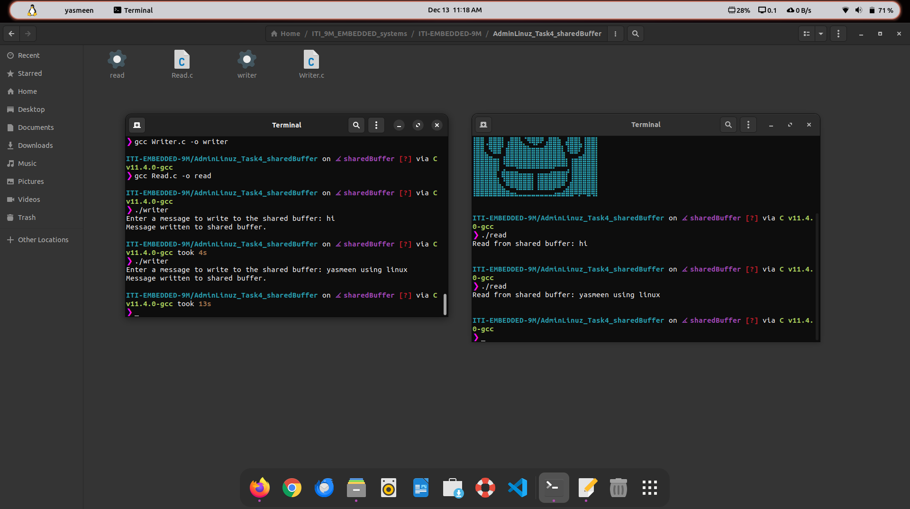

# Yasmeen Yasser Mohamed
# Task4_adminLinux_Shared Buffer Between 2 processes :)

> creating shared buffer between 2 processes one write to it and the another read from it 

## Using a File in /dev/shm as a Shared Buffer

    /dev/shm is a memory-backed temporary filesystem available in Linux. Files created here exist only in RAM and are automatically deleted on system reboot.

## How It Works

    The writer program creates or overwrites a file (/dev/shm/shared_buffer) and writes user input to it.
    The reader program opens the same file and reads its content.
    Since /dev/shm is memory-backed, the operations are very fast.

## Clean Up

If you're done with the shared buffer, just delete the file:

	rm /dev/shm/shared_buffer 

# The difference between a software shared buffer and a kernel shared buffer

### 1. Software Shared Buffer

* A software shared buffer is implemented in user space. It typically involves user-level programming constructs (like files or memory regions) to enable sharing between processes. The kernel's involvement is minimal.

* Ideal for situations where two processes need to exchange information directly in user space without high performance or real-time constraints.

* The buffer is implemented using mechanisms like shared memory files (/dev/shm or mmap), named pipes (FIFO), or regular files.

### 2. Kernel Shared Buffer

* A kernel shared buffer is implemented in kernel space, often as part of system-level inter-process communication (IPC). The kernel provides facilities and enforces synchronization and access control.

* Essential for real-time applications, high-performance IPC, or when multiple processes need synchronized access to shared data.

* The buffer resides in kernel memory, and processes access it via system calls or IPC mechanisms.

## Software Shared Buffer vs Kernel Shared Buffer

| Feature                | Software Shared Buffer                       | Kernel Shared Buffer                      |
|------------------------|----------------------------------------------|-------------------------------------------|
| **Location**           | Resides in user space (e.g., files, memory). | Resides in kernel space.                  |
| **Access**             | Accessed via file I/O or user-space APIs.    | Accessed using system calls.              |
| **Performance**        | Slightly slower (user-space copying).        | Faster, especially for large data.        |
| **Setup**              | Easier to set up (e.g., `/dev/shm`, pipes).  | More complex; requires system calls like  POSIX Shared Memory (shm_open) , or System V Shared Memory (shmget and shmat).      |
| **Synchronization**    | Handled by user code (e.g., locks).          | Kernel-managed synchronization.           |
| **Use Cases**          | Simple IPC, lightweight sharing.             | Real-time, high-performance IPC.          |
| **Scalability**        | Less efficient for many processes.           | Scales well for complex IPC scenarios.    |
