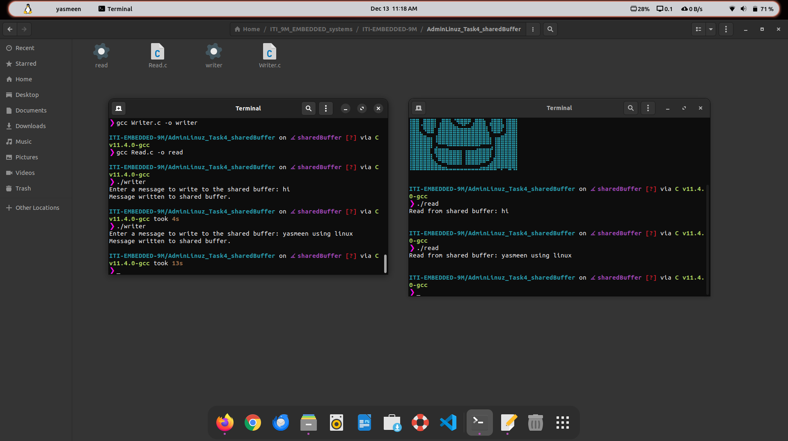

# Yasmeen Yasser Mohamed
# Task4_adminLinux_Shared Buffer Between 2 processes :)

> creating shared buffer between 2 processes one write to it and the another read from it 

## Using a File in /dev/shm as a Shared Buffer

    /dev/shm is a memory-backed temporary filesystem available in Linux. Files created here exist only in RAM and are automatically deleted on system reboot.

## How It Works

    The writer program creates or overwrites a file (/dev/shm/shared_buffer) and writes user input to it.
    The reader program opens the same file and reads its content.
    Since /dev/shm is memory-backed, the operations are very fast.

## Clean Up

If you're done with the shared buffer, just delete the file:

> rm /dev/shm/shared_buffer 